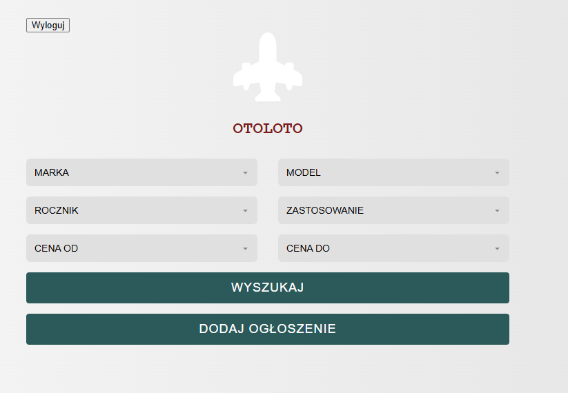
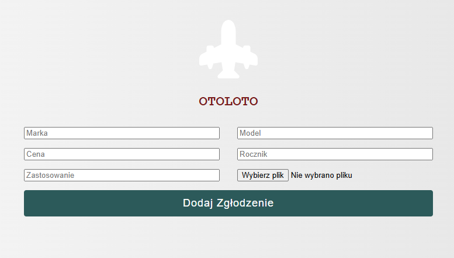
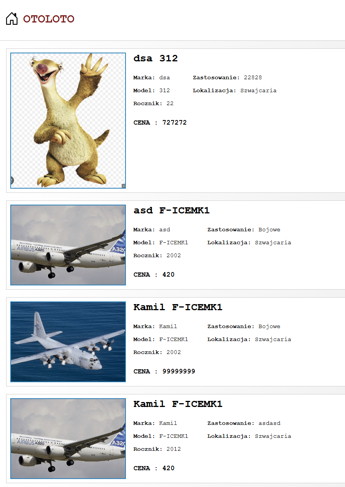

# OTOLOTO
✈️ OTOLOTO – Kupuj i sprzedawaj samoloty!
OTOLOTO to innowacyjna platforma internetowa umożliwiająca kupno i sprzedaż samolotów w prosty, bezpieczny i wygodny sposób. Niezależnie od tego, czy jesteś właścicielem prywatnego odrzutowca, sprzedawcą samolotów komercyjnych czy kolekcjonerem historycznych maszyn, OTOLOTO to miejsce dla Ciebie!
👥 Wkład i rozwój
Chcesz pomóc w rozwoju OTOLOTO? Zapraszamy do zgłaszania issue, pull requestów oraz dzielenia się pomysłami!

📜 Licencja
OTOLOTO jest dostępne na licencji MIT.
🚀 Kluczowe funkcje
✅ Dodawanie ogłoszeń – Sprzedawcy mogą łatwo tworzyć oferty, dodając szczegóły techniczne, zdjęcia i cenę.
✅ Wyszukiwanie i filtrowanie – Kupujący mogą przeszukiwać oferty według modelu, producenta, roku produkcji, ceny i innych parametrów.
✅ Bezpieczne transakcje – Wbudowany system weryfikacji sprzedawców i zabezpieczenia płatności.
✅ Panel użytkownika – Intuicyjny interfejs dla sprzedawców i kupujących do zarządzania ofertami i zapytaniami.
✅ Powiadomienia i wiadomości – Możliwość kontaktu między użytkownikami oraz alerty o nowych ofertach.
👥 Wkład i rozwój

Chcesz pomóc w rozwoju OTOLOTO? Zapraszamy do zgłaszania issue, pull requestów oraz dzielenia się pomysłami!

Wygląd strony:
Logowanie:

Rejestracja:

Wyszukiwanie ogłoszeń:

Dodawanie ogłoszeń:

Zbiorcza lista ogłoszeń:

Aplikacja działa na desktopach oraz urządzeniach mobilnych

📜 Licencja
OTOLOTO jest dostępne na licencji MIT.